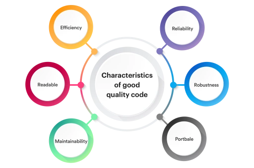
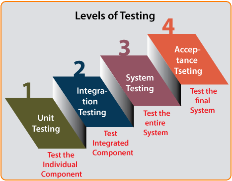

# Development practices

Development practices range from practices around writing readable, structured, testable and maintainable code, which has got the (just/right/necessary level of documentation to following processes ensuring code review and knowledge sharing and identifying areas, that can be automated. The following sections describes these areas and practices.

## Code quality

The term 'quality code' might bring up different views from different parties. It can be evaluated and discussed (to obtain consensus) though, based on some characteristics depicted below. Following a set of common coding rules and using analyzers to guide this behaviour helps keeping a homogeneous code base.



- ✔️ **Do** use static code analysis / analyzers
- ✔️ **Do** use .editorconfig to enforce formatting and code style conventions to achieve consistent code
- ✔️ **Do** use `ATC coding rules`
<br /><br />

### ATC coding rules

The ATC-Team have defined a setup on how to align; Settings, rules, style etc. in a project / repository.

Benefits of this alignment setup:

- Enforce code style
- Ensure less bugs
- Ensure better performance
- Ensure better design and maintainability of code

The ATC coding rules setup is built and based on top of:

- [.editorconfig](https://editorconfig.org)
- [Directory.Build.props](https://docs.microsoft.com/en-us/visualstudio/msbuild/customize-your-build?view=vs-2022) for .NET projects/solutions

Read more on ATC coding rules [here](https://github.com/atc-net/atc-coding-rules).
<br /><br />

### ATC coding rules updater

The [atc-coding-rules-updater](https://github.com/atc-net/atc-coding-rules-updater) is a cross platform command line application known as a CLI tool.

The main purpose of this application is to create and maintain a project / repository with [ATC coding rules](https://github.com/atc-net/atc-coding-rules).
<br /><br />

## Source Control

GIT is the defacto standard system for source code version control and is well integrated into development environments supporting cloud development. It has been choosen as THE source control system and the following practices is centered around this.

- ✔️ **Do** have a branching strategy in place
- ✔️ **Do** use branching policies to enforce branching strategy
- ✔️ **Do** only accept `PR`'s (`P`ull `R`equests) into `main` branch
- ✔️ **Do** require associated work item with Pull Requests for traceability
- ✔️ **Do** delete branch after merge
- 💭 **Consider** using feature flags when using Trunk-Based development
- 💭 **Consider** using branch name as Pull Request title
- 💭 **Consider** using Trunk-Based development like Release Flow or GitHub Flow
- ❌ **Do not** place binaries under source control. If doing so, be very aware of what those binaries are and the size of them
- ❌ **Do not** squash branch upon completing Pull Requests
- ❌ **Do not** keep secrets in source code

## Git Commits

A properly formed Git commit subject line should always be able to complete the following sentence:

*If applied, this commit will &lt;your subject line here&gt;*

### Commit Samples

```powershell
[type](optional scope): [subject]

[optional body]

[optional footer]
```

### Types

Must be one of the following:

|Type|Meaning|
|---|---|
| **`build:`**    | Build related changes |
| **`ci:`**       | CI related changes |
| **`chore:`**    | Build process or auxiliary tool - changes |
| **`docs:`**     | Documentation only changes |
| **`feat:`**     | A new feature |
| **`fix:`**      | A bug fix |
| **`perf:`**     | A code change that improves performance |
| **`refactor:`** | A code change that neither fixes a - bug or adds a feature|
| **`revert:`**   | Reverting things|
| **`style:`**    | Markup, white-space, formatting, - missing semi-colons... |
| **`test:`**     | Adding missing tests |

### Scope

A scope may be provided to a commit’s type, to provide additional contextual information and is contained within parenthesis, *e.g., feat(parser): add the ability to parse arrays.*

### Subject

The subject contains a succinct description of the change:

- Use the imperative, present tense: "change" not "changed" nor "changes"
- No dot (.) at the end.

### Body

Just as in the subject, use the imperative, present tense: "change" not "changed" nor "changes". The body should include the motivation for the change and contrast this with previous behavior.

### **The 7 rules of a great commit message**

- Separate subject from the body with a blank line
- Limit the subject line to 50 characters
- Summary in the present tense. Not capitalized.
- Do not end the subject line with a period
- Use the imperative mood in the subject line
- Wrap the body at 72 characters
- Use the body to explain what and why vs. how

### **Examples:**

```text
feat(shopping cart): Add the amazing button
```

```text
feat(api account): Add update endpoint
```

```text
fix: Add missing parameter to service call

The error occurred because of <reasons>.
```

```text
style: Remove empty line
```

## Code review

- ✔️ **Do** include the purpose of the Pull Request
    > *This is a spike to explore…This simplifies the display of… This fixes handling of…*
- ✔️ **Do** remember that anyone in the company could be reading this Pull Request, so the content and tone may inform people other than those currently participating
- ✔️ **Do** @mention individuals/teams that you specifically want to involve in the Pull Request and consider mentioning why
- 💭 **Consider** providing an overview of why the work is taking place
    > *Include relevant links; don’t assume familiarity with the history*
- 💭 **Consider** being explicit about what specific feedback you want

## The Four Levels of Software Testing

The following describes different types or levels of functional testing. It doesn't describe other areas of testing like security testing, penetrationn testing or performance testing. Unit testing and integration testing is regarded an integral part of the normal feature development and should be automated and included in the build and deployment pipelines (CI/CD).



### **Unit Testing**

During this first round of testing, the program is submitted to assessments that focus on specific units or components of the software to determine whether each one is fully functional. The main aim of this endeavor is to determine whether the application functions as designed. In this phase, `a unit can refer to a function, individual program or even a procedure`, and a White-box Testing method is usually used to get the job done. One of the biggest benefits of this testing phase is that it can be run every time a piece of code is changed, allowing issues to be resolved as quickly as possible. It’s quite common for software developers to perform unit tests before delivering software to testers for formal testing.

### **Integration Testing**

Integration testing allows individuals the opportunity to combine all of the units within a program and test them as a group. This testing level is designed to `find interface defects between the modules/functions`. This is particularly beneficial because it determines how efficiently the units are running together. Keep in mind that no matter how efficiently each unit is running, if they aren’t properly integrated, it will affect the functionality of the software program. In order to run these types of tests, individuals can make use of various testing methods, but the specific method that will be used to get the job done will depend greatly on the way in which the units are defined.

### **System Testing**

System testing is the first level in which `the complete application is tested as a whole`. The goal at this level is to evaluate whether the system has complied with all of the outlined requirements and to see that it meets Quality Standards. System testing is undertaken by independent testers who haven’t played a role in developing the program. This testing is performed in an environment that closely mirrors production. System Testing is very important because it verifies that the application meets the technical, functional, and business requirements that were set by the customer.

### **Acceptance Testing**

The final level, Acceptance testing (or User Acceptance Testing), is conducted to `determine whether the system is ready for release`. During the Software development life cycle, requirements changes can sometimes be misinterpreted in a fashion that does not meet the intended needs of the users. During this final phase, the user will test the system to find out whether the application meets their business’ needs. Once this process has been completed and the software has passed, the program will then be delivered to production.

## Design for failure

Traditionally we've tried to "avoid" failure by doing whatever we could to make services/components "not fail". We would deploy monolithic "appliances" (hardware or software) and if that appliance failed it was a significant event. As we start to move toward distributed systems, especially Microservices, we find that there are many more points of failure. Microservices are implemented as a collection of services that evolve independently and interact and react to their surrounding environments including the changing of user/customer behaviors, business strategy/direction, system behavior, and even other services. One premise of these types of complex-adaptive systems is the ability to withstand failures and unexpected faults.

To do this, you must design your services with failure in mind. There are a handful of practices that come to mind; Maximize service availability, self-healing, Isolate the "blast radius" of any single failure and continually prove your system has been designed for failure.

- ✔️ **Do** design and code for transient faults
    > *Use mature libraries like Polly.Net*
- ✔️ **Do** instrument your application to emit telemetry
- ✔️ **Do** expose health check endpoints to monitor availability

## Documentation

Keep documentation short and precise and if possible, it should be auto-generated. Part of the documentation is also the traceability between all items/assets. From Idea/requirement to code change, to test, to build and deployed environment.

- ✔️ **Do** keep documentation, which is versioned with the code as part of the code.
    > *This would normally mean keeping the documentation in the same repository as the code*
- ✔️ **Do** keep notes related to requirements or other documentation assets as part of the assets themselves
    > *By having the comments and notes leading to decisions as part of the documentation assets themselves it will help at later stages to document why decisions were taken and will reduce re-work*
- ✔️ **Do** use a tool that supports traceability from very first idea/requirement to deployed solution in production environment
    > *This will automatically document which changes relate to which requirements and further if the change has been tested and finally to which environments the change has been deployed*
- 💭 **Consider** using tools that can auto-generate documentation of API’s and architecture
    > *This will keep the documentation automatically up-to-date and will lessen the chance of drift between code and documentation*

## REST API design

`REST` is an acronym for `RE`presentational `S`tate `T`ransfer and an architectural style for `distributed hypermedia systems`.

`API` is the acronym for `A`pplication `P`rogramming `I`nterface, which is a software intermediary that allows two applications to talk to each other.
<br /><br />

### What is API Design?

Designing (also known as Modeling) your API involves describing all of the inputs and outputs across the footprint of your entire service. Your API design will answer questions like:

- What are the different resources and operations available in your API?
- How does your API authenticate requests?
- What are the different data models associated with your service?
- How does your API handle errors?
<br /><br />

### Design first approach (OpenAPI specification)

There are two ways to create an API

- The `Code First` approach is a more traditional approach to building APIs, with the development of code happening after the business requirements are laid out, eventually generating the documentation from the code.
- The `Design First` approach advocates for designing the API’s contract first before writing any code. This is a relatively new approach, but is fast catching on, especially with the use of OpenAPI specification formats.

The philosophy behind the use of `Design First` as the `best approach` in the development and maintenance of an REST API revolves around a specification in the well know [OpenAPI specification](https://swagger.io/specification).

Benefits of this `Design First` approach:

- Empower technical and non-technical stakeholders to create and collaborate on API designs.
- `Server API` and `Client consumer` should agree around the specification before implementation - this saves time based on:
  - Single source of truth for the API being designed/implemented/maintained
  - Enforces the; `think, plan and execute` over `try it out` strategy
  - Better code documentation when good specifications are made upfront
  - Gives the possibility for parallel development of API and client(s)
  - Specification is implementation language independent and as such enables the option for code-generation to a specific language and/or framework.
  - Enables AGILE development with rapid development when using tools for code-generation
  - Alot of OpenAPI specification tools already exists on the market

Deficiencies that are often seen when using `Code First` approach:

- `Server API` and `Client consumer` are hard to keep in sync, which adds time upon the implementation phase.
- It seems to be more fun in the startup phase for a developer, but happy-path is not always fun path in the long run.
- Developeres wants to code, but API's is not only about PoC's, and PoC's often have to be moved to production.

Recommended tools for working with OpenAPI specifications:

- [Stoplight.io](https://stoplight.io/). Read more about it in the [Stoplight Documentation](https://meta.stoplight.io)
- [OpenAPI extension for Visual Studio Code](https://marketplace.visualstudio.com/items?itemName=42Crunch.vscode-openapi)
<br /><br />

### ATC REST API Generator CLI Tool

The [atc-rest-api-generator](https://github.com/atc-net/atc-rest-api-generator) is a cross platform command line application known as CLI tool.

The main purpose of this application is to create and maintain a REST-API service based on an OpenAPI specification file. So the concept is the `Design First` approach.

The `atc-rest-api-generator` is categorized as a `Rapid Application Development Tool` for REST-API in .NET/C#.

The `atc-rest-api-generator` can also create and maintain a client library etc. Today client parts could be used from a client written in `C#` or in `Typescript`.
